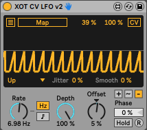

# XOT-Modulators

Max for Live effect. Adding a unipolar/bipolar mode selector to Ableton (CV) Modulators.

(c) Jaap-Henk Hoepman (info@xot.nl)

## Description

This effect is a simple adaptation of Ableton Live's Modulators (LFO and Shaper) both for the CV and normal versions, adding a unipolar/bipolar mode selector. 

In *bipolar* (~) mode (as the original effect implements), the modulator oscillates around the offset. As a result the offset corresponds to the mean output of the oscillator, which is stable even when the depth is modulated. 

In *positive unipolar* mode (+, new), the LFO oscillates between offset and offset + depth, in other words the LFO signal is added to the offset. This guarantees that the offset always corresponds to the lowest signal output of the LFO, even when the depth is modulated.

In *negatove unipolar* mode (-, also new), the LFO oscillates between offset - depth and offset, in other words the LFO signal is subtracted from the offset. 
This guarantees that the offset always corresponds to the highest signal output of the LFO, even when the depth is modulated.

With this modification, the modulators are more easily used in modular rack style synthesis setups.
